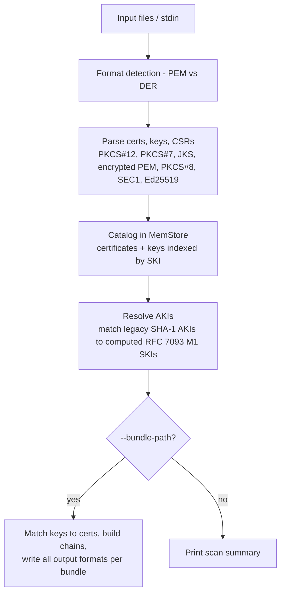

# certkit

A Swiss Army knife for TLS/SSL certificates. Inspect, verify, bundle, scan, and generate certificates and keys -- all from a single tool.

## What can it do?

- **Inspect** any certificate, key, or CSR and see exactly what's in it
- **Verify** that a cert chains to a trusted root, matches its key, and isn't about to expire
- **Bundle** a leaf cert into a full chain for your web server (nginx, Apache, HAProxy, etc.)
- **Scan** a directory full of certs and keys to understand what you have
- **Generate** new key pairs and CSRs for certificate renewals
- **Convert** between formats -- PEM, PKCS#12, JKS, PKCS#7, DER, Kubernetes Secrets

Works with every common format out of the box. No OpenSSL gymnastics required.

## Web App

Use certkit directly in your browser at **[certkit.pages.dev](https://certkit.pages.dev)**. Drop certificate and key files to inspect, match, and export organized bundles -- all processing happens locally via WebAssembly. No files are uploaded.

## Install

### Homebrew (macOS)

```sh
brew install sensiblebit/tap/certkit
```

### Debian/Ubuntu (Linux)

Download the `.deb` package from the [latest release](https://github.com/sensiblebit/certkit/releases/latest) and install:

```sh
sudo dpkg -i certkit_*.deb
```

### From source

Requires Go 1.25+.

```sh
go build -o certkit ./cmd/certkit/
```

### Shell Completion

certkit supports tab completion for bash, zsh, fish, and PowerShell. Run `certkit completion --help` for details, or set it up with:

```sh
# Bash
source <(certkit completion bash)

# Zsh
source <(certkit completion zsh)

# Fish
certkit completion fish | source

# PowerShell
certkit completion powershell | Out-String | Invoke-Expression
```

To load completions for every new session, see `certkit completion <shell> --help` for persistent installation instructions.

## Quick Start

See what's in a certificate:

```sh
certkit inspect cert.pem
```

Check if it's valid and not expiring soon:

```sh
certkit verify cert.pem --expiry 30d
```

Build the full chain your web server needs:

```sh
certkit bundle cert.pem -o chain.pem
```

See [EXAMPLES.md](EXAMPLES.md) for a complete walkthrough of every command with real-world scenarios.

## Commands

| Command | What it does |
|---|---|
| `certkit inspect <file>` | Show what's in a cert, key, or CSR |
| `certkit verify <file>` | Check chain, key match, and expiry |
| `certkit bundle <file>` | Build a certificate chain from a leaf cert |
| `certkit scan <path>` | Scan a directory and catalog everything found |
| `certkit keygen` | Generate a new key pair (and optionally a CSR) |
| `certkit csr` | Generate a CSR from a template, cert, or existing CSR |

## License

[MIT](LICENSE)

---

## Reference

### Global Flags

| Flag | Default | Description |
|---|---|---|
| `--log-level`, `-l` | `info` | Log level: `debug`, `info`, `warn`, `error` |
| `--passwords`, `-p` | | Comma-separated passwords for encrypted keys |
| `--password-file` | | File containing passwords, one per line |
| `--allow-expired` | `false` | Include expired certificates |

Common passwords (`""`, `"password"`, `"changeit"`, `"keypassword"`) are always tried automatically.

### Inspect Flags

| Flag | Default | Description |
|---|---|---|
| `--format` | `text` | Output format: `text`, `json` |

### Verify Flags

| Flag | Default | Description |
|---|---|---|
| `--key` | | Private key file to check against the certificate |
| `--expiry`, `-e` | | Check if cert expires within duration (e.g., `30d`, `720h`) |
| `--trust-store` | `mozilla` | Trust store: `system`, `mozilla` |
| `--format` | `text` | Output format: `text`, `json` |

Chain verification is always performed. When the input contains an embedded private key (PKCS#12, JKS), key match is checked automatically.

### Bundle Flags

| Flag | Default | Description |
|---|---|---|
| `--key` | | Private key file (PEM) |
| `--out-file`, `-o` | *(stdout)* | Output file |
| `--format` | `pem` | Output format: `pem`, `chain`, `fullchain`, `p12`, `jks` |
| `--force`, `-f` | `false` | Skip chain verification |
| `--trust-store` | `mozilla` | Trust store: `system`, `mozilla` |

### Scan Flags

| Flag | Default | Description |
|---|---|---|
| `--bundle-path` | | Export bundles to this directory |
| `--config`, `-c` | `./bundles.yaml` | Path to bundle config YAML |
| `--force`, `-f` | `false` | Allow export of untrusted certificate bundles |
| `--duplicates` | `false` | Export all certificates per bundle, not just the newest |
| `--dump-keys` | | Dump all discovered keys to a single PEM file |
| `--dump-certs` | | Dump all discovered certificates to a single PEM file |
| `--max-file-size` | `10485760` | Skip files larger than this size in bytes (0 to disable) |
| `--save-db` | | Save the in-memory database to disk after scanning |
| `--load-db` | | Load an existing database into memory before scanning |
| `--format` | `text` | Output format: `text`, `json` |

### Keygen Flags

| Flag | Default | Description |
|---|---|---|
| `--algorithm`, `-a` | `ecdsa` | Key algorithm: `rsa`, `ecdsa`, `ed25519` |
| `--bits`, `-b` | `4096` | RSA key size in bits |
| `--curve` | `P-256` | ECDSA curve: `P-256`, `P-384`, `P-521` |
| `--out-path`, `-o` | *(stdout)* | Output directory |
| `--cn` | | Common Name (triggers CSR generation) |
| `--sans` | | Comma-separated SANs (triggers CSR generation) |

### CSR Flags

| Flag | Default | Description |
|---|---|---|
| `--template` | | JSON template file for CSR generation |
| `--cert` | | PEM certificate to use as CSR template |
| `--from-csr` | | Existing PEM CSR to re-sign with a new key |
| `--key` | | Existing private key file (PEM); generates new if omitted |
| `--algorithm`, `-a` | `ecdsa` | Key algorithm for generated keys |
| `--bits`, `-b` | `4096` | RSA key size in bits |
| `--curve` | `P-256` | ECDSA curve |
| `--out-path`, `-o` | *(stdout)* | Output directory |

Exactly one of `--template`, `--cert`, or `--from-csr` is required.

### Exit Codes

| Code | Meaning |
|---|---|
| `0` | Success |
| `1` | General error (bad input, missing file, etc.) |
| `2` | Validation failure (chain invalid, key mismatch, expired) |

### Bundle Configuration

Bundles are defined in a YAML file that maps certificate Common Names to named bundles. An optional `defaultSubject` provides fallback X.509 subject fields for CSR generation.

```yaml
defaultSubject:
  country: [US]
  province: [California]
  locality: [San Diego]
  organization: [Company, Inc.]
  organizationalUnit: [DevOps]

bundles:
  - bundleName: examplecom-tls
    commonNames:
      - '*.example.com'
      - example.com

  - bundleName: exampleio-tls
    commonNames:
      - '*.example.io'
      - example.io
    subject:  # overrides defaultSubject for this bundle
      country: [GB]
      province: [London]
      locality: [London]
      organization: [Company UK, Ltd.]
      organizationalUnit: [Platform Engineering]
```

Bundles without an explicit `subject` block inherit from `defaultSubject`. Certificate-to-bundle matching uses exact Common Name comparison against the `commonNames` list (a CN of `*.example.com` matches the literal wildcard string, not subdomains).

### Bundle Output Files

When running `certkit scan --bundle-path`, each bundle produces the following files under `<dir>/<bundleName>/`:

| File | Contents |
|---|---|
| `<cn>.pem` | Leaf certificate |
| `<cn>.chain.pem` | Leaf + intermediates |
| `<cn>.fullchain.pem` | Leaf + intermediates + root |
| `<cn>.intermediates.pem` | Intermediate certificates |
| `<cn>.root.pem` | Root certificate |
| `<cn>.key` | Private key (PEM, mode 0600) |
| `<cn>.p12` | PKCS#12 archive (default password: `changeit`, override via `--passwords`, mode 0600) |
| `<cn>.k8s.yaml` | Kubernetes `kubernetes.io/tls` Secret (mode 0600) |
| `<cn>.json` | Certificate metadata |
| `<cn>.yaml` | Certificate and key metadata |
| `<cn>.csr` | Certificate Signing Request |
| `<cn>.csr.json` | CSR details (subject, SANs, key algorithm) |

Wildcard characters in the CN are replaced with `_` in filenames (e.g., `*.example.com` becomes `_.example.com`). The `.intermediates.pem` and `.root.pem` files are only created when those certificates exist in the chain.

### Library

The `certkit` Go package provides reusable certificate utilities:

```go
import "github.com/sensiblebit/certkit"

// Parse certificates and keys
certs, _ := certkit.ParsePEMCertificates(pemData)
key, _ := certkit.ParsePEMPrivateKey(keyPEM)

// Compute identifiers
fingerprint := certkit.CertFingerprint(cert)
colonFP := certkit.CertFingerprintColonSHA256(cert)  // AA:BB:CC format
ski := certkit.CertSKI(cert)

// Check expiry
if certkit.CertExpiresWithin(cert, 30*24*time.Hour) {
    // cert expires within 30 days
}

// Build verified chains (library defaults to system trust store)
opts := certkit.DefaultOptions()
opts.TrustStore = "mozilla" // or "system" (the default)
bundle, _ := certkit.Bundle(ctx, leaf, opts)

// Generate keys
ecKey, _ := certkit.GenerateECKey(elliptic.P256())
rsaKey, _ := certkit.GenerateRSAKey(4096)

// Generate CSRs
csrPEM, keyPEM, _ := certkit.GenerateCSR(leaf, nil) // auto-generates EC P-256 key

// PKCS operations
p12, _ := certkit.EncodePKCS12(key, leaf, intermediates, "password")
p7, _ := certkit.EncodePKCS7(certs)
jks, _ := certkit.EncodeJKS(key, leaf, intermediates, "changeit")
```

### How It Works



Expired certificates are always ingested; expiry filtering is output-only (`--allow-expired` overrides). SKI computation uses RFC 7093 Method 1 (SHA-256 truncated to 160 bits). Non-root certificate AKIs are resolved post-ingestion by matching against a multi-hash lookup (RFC 7093 M1 + legacy SHA-1) of all CA certificates.
