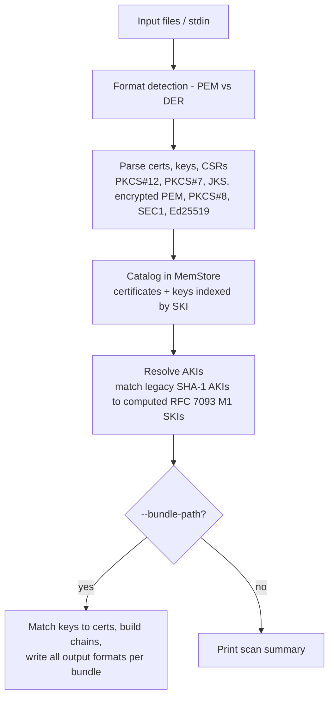

# certkit

> **Note:** certkit is under active development. CLI flags, output formats, and library APIs may change between releases. Do not rely on interface stability for scripting or automation until a 1.0 release.

A Swiss Army knife for TLS/SSL certificates. Inspect, verify, bundle, scan, and generate certificates and keys -- all from a single tool.

## What can it do?

- **Inspect** any certificate, key, or CSR and see exactly what's in it
- **Verify** that a cert chains to a trusted root, matches its key, and isn't about to expire
- **Connect** to a TLS server and display its certificate chain, cipher suite, and ALPN
- **Bundle** a leaf cert into a full chain for your web server (nginx, Apache, HAProxy, etc.)
- **Convert** between PEM, DER, PKCS#12, JKS, and PKCS#7
- **Sign** certificates -- self-signed CAs or issue certs from CSRs
- **Scan** a directory full of certs and keys to understand what you have
- **Generate** new key pairs and CSRs for certificate renewals
- **Check revocation** via OCSP or CRL

Works with every common format out of the box. No OpenSSL gymnastics required.

## Web App

Use certkit directly in your browser at **[certkit.pages.dev](https://certkit.pages.dev)**. Drop certificate and key files to inspect, match, and export organized bundles -- all processing happens locally via WebAssembly. No files are uploaded.

## Install

### Homebrew (macOS)

```sh
brew install sensiblebit/tap/certkit
```

### Homebrew Nightly (main snapshots)

Nightly cask updates are published automatically on every push to `main`.

```sh
brew install sensiblebit/tap/certkit@nightly
certkit --version
```

### Debian/Ubuntu (Linux)

Download the `.deb` package from the [latest release](https://github.com/sensiblebit/certkit/releases/latest) and install:

```sh
sudo dpkg -i certkit_*.deb
```

### From source

Requires Go 1.25+.

```sh
go build -o certkit ./cmd/certkit/
```

### Shell Completion

certkit supports tab completion for bash, zsh, fish, and PowerShell. Run `certkit completion --help` for details, or set it up with:

```sh
# Bash
source <(certkit completion bash)

# Zsh
source <(certkit completion zsh)

# Fish
certkit completion fish | source

# PowerShell
certkit completion powershell | Out-String | Invoke-Expression
```

To load completions for every new session, see `certkit completion <shell> --help` for persistent installation instructions.

## Quick Start

See what's in a certificate:

```sh
certkit inspect cert.pem
```

Check if it's valid and not expiring soon:

```sh
certkit verify cert.pem --expiry 30d
```

Build the full chain your web server needs:

```sh
certkit bundle cert.pem -o chain.pem
```

See [EXAMPLES.md](EXAMPLES.md) for a complete walkthrough of every command with real-world scenarios.

## Commands

| Command                     | What it does                                            |
| --------------------------- | ------------------------------------------------------- |
| `certkit inspect <file>`    | Show what's in a cert, key, or CSR                      |
| `certkit verify <file>`     | Check chain, key match, and expiry                      |
| `certkit connect <host>`    | Test a TLS connection and display the certificate chain |
| `certkit bundle <file>`     | Build a certificate chain from a leaf cert              |
| `certkit convert <file>`    | Convert between PEM, DER, PKCS#12, JKS, and PKCS#7      |
| `certkit sign self-signed`  | Create a self-signed certificate                        |
| `certkit sign csr <file>`   | Sign a CSR with a CA certificate and key                |
| `certkit scan <path>`       | Scan a directory and catalog everything found           |
| `certkit keygen`            | Generate a new key pair (and optionally a CSR)          |
| `certkit csr`               | Generate a CSR from a template, cert, or existing CSR   |
| `certkit ocsp <file>`       | Check certificate revocation status via OCSP            |
| `certkit crl <file-or-url>` | Parse a CRL and check for revoked certificates          |

## License

[MIT](LICENSE)

---

## Reference

### Global Flags

<!-- certkit:flags:global -->
| Flag                | Default | Description                                                                        |
| ------------------- | ------- | ---------------------------------------------------------------------------------- |
| `--allow-expired`   | `false` | Include expired certificates                                                       |
| `--json`            | `false` | Output in JSON format                                                              |
| `--log-level`, `-l` | `info`  | Log level: debug, info, warn, error                                                |
| `--password-file`   |         | File containing passwords, one per line                                            |
| `--passwords`, `-p` |         | Comma-separated passwords for encrypted keys                                       |
| `--verbose`, `-v`   | `false` | Extended details in output (serial, key info, signature algorithm, key usage, EKU) |
<!-- /certkit:flags -->

Common passwords (`""`, `"password"`, `"changeit"`, `"keypassword"`) are always tried automatically.

### Inspect Flags

<!-- certkit:flags:inspect -->
| Flag                      | Default | Description                                     |
| ------------------------- | ------- | ----------------------------------------------- |
| `--allow-private-network` | `false` | Allow AIA fetches to private/internal endpoints |
| `--format`                | `text`  | Output format: text, json                       |
<!-- /certkit:flags -->

### Verify Flags

<!-- certkit:flags:verify -->
| Flag                      | Default   | Description                                              |
| ------------------------- | --------- | -------------------------------------------------------- |
| `--allow-private-network` | `false`   | Allow AIA/OCSP/CRL fetches to private/internal endpoints |
| `--crl`                   | `false`   | Check CRL distribution points for revocation             |
| `--diagnose`              | `false`   | Show diagnostics when chain verification fails           |
| `--expiry`, `-e`          |           | Check if cert expires within duration (e.g., 30d, 720h)  |
| `--format`                | `text`    | Output format: text, json                                |
| `--key`                   |           | Private key file to check against the certificate        |
| `--ocsp`                  | `false`   | Check OCSP revocation status                             |
| `--trust-store`           | `mozilla` | Trust store: system, mozilla                             |
<!-- /certkit:flags -->

Chain verification is always performed. When the input contains an embedded private key (PKCS#12, JKS), key match is checked automatically. Use `--ocsp` and/or `--crl` to check revocation status (requires network access and a valid chain).

### Connect Flags

<!-- certkit:flags:connect -->
| Flag                      | Default | Description                                                 |
| ------------------------- | ------- | ----------------------------------------------------------- |
| `--allow-private-network` | `false` | Allow AIA/OCSP/CRL fetches to private/internal endpoints    |
| `--ciphers`               | `false` | Enumerate all supported cipher suites with security ratings |
| `--crl`                   | `false` | Check CRL distribution points for revocation                |
| `--format`                | `text`  | Output format: text, json                                   |
| `--no-ocsp`               | `false` | Disable automatic OCSP revocation check                     |
| `--servername`            |         | Override SNI hostname (defaults to host)                    |
<!-- /certkit:flags -->

Port defaults to 443 if not specified. OCSP revocation status is checked automatically (best-effort); use `--no-ocsp` to disable. Use `--verbose` for extended details (serial, key info, signature algorithm, key usage, EKU).

### Bundle Flags

<!-- certkit:flags:bundle -->
| Flag                      | Default    | Description                                     |
| ------------------------- | ---------- | ----------------------------------------------- |
| `--allow-private-network` | `false`    | Allow AIA fetches to private/internal endpoints |
| `--force`, `-f`           | `false`    | Skip chain verification                         |
| `--format`                | `pem`      | Output format: pem, chain, fullchain, p12, jks  |
| `--key`                   |            | Private key file (PEM)                          |
| `--out-file`, `-o`        | _(stdout)_ | Output file                                     |
| `--trust-store`           | `mozilla`  | Trust store: system, mozilla                    |
<!-- /certkit:flags -->

### Convert Flags

<!-- certkit:flags:convert -->
| Flag               | Default            | Description                                                             |
| ------------------ | ------------------ | ----------------------------------------------------------------------- |
| `--key`            |                    | Private key file (PEM). Keys are matched to certificates automatically. |
| `--out-file`, `-o` | _(stdout for PEM)_ | Output file (required for binary formats)                               |
| `--to`             | _(required)_       | Output format: pem, der, p12, jks, p7b                                  |
<!-- /certkit:flags -->

Input format is auto-detected.

### Sign Self-Signed Flags

<!-- certkit:flags:sign-self-signed -->
| Flag               | Default      | Description                                               |
| ------------------ | ------------ | --------------------------------------------------------- |
| `--cn`             | _(required)_ | Common Name for the certificate                           |
| `--days`           | `3650`       | Validity period in days                                   |
| `--is-ca`          | `true`       | Set CA:TRUE basic constraint                              |
| `--key`            |              | Existing private key file (generates EC P-256 if omitted) |
| `--out-file`, `-o` | _(stdout)_   | Output file                                               |
<!-- /certkit:flags -->

### Sign CSR Flags

<!-- certkit:flags:sign-csr -->
| Flag               | Default      | Description                              |
| ------------------ | ------------ | ---------------------------------------- |
| `--ca`             | _(required)_ | CA certificate file (PEM)                |
| `--ca-key`         | _(required)_ | CA private key file (PEM)                |
| `--copy-sans`      | `true`       | Copy SANs from CSR to issued certificate |
| `--days`           | `365`        | Validity period in days                  |
| `--out-file`, `-o` | _(stdout)_   | Output file                              |
<!-- /certkit:flags -->

### Scan Flags

<!-- certkit:flags:scan -->
| Flag                      | Default          | Description                                              |
| ------------------------- | ---------------- | -------------------------------------------------------- |
| `--aia-timeout`           | `2s`             | Timeout for AIA certificate fetches (e.g. 2s, 500ms)     |
| `--allow-private-network` | `false`          | Allow AIA fetches to private/internal endpoints          |
| `--bundle-path`           |                  | Export bundles to this directory                         |
| `--config`, `-c`          | `./bundles.yaml` | Path to bundle config YAML                               |
| `--dump-certs`            |                  | Dump all discovered certificates to a single PEM file    |
| `--dump-keys`             |                  | Dump all discovered keys to a single PEM file            |
| `--duplicates`            | `false`          | Export all certificates per bundle, not just the newest  |
| `--force`, `-f`           | `false`          | Allow export of untrusted certificate bundles            |
| `--format`                | `text`           | Output format: text, json                                |
| `--load-db`               |                  | Load an existing database into memory before scanning    |
| `--max-file-size`         | `10485760`       | Skip files larger than this size in bytes (0 to disable) |
| `--save-db`               |                  | Save the in-memory database to disk after scanning       |
<!-- /certkit:flags -->

### Keygen Flags

<!-- certkit:flags:keygen -->
| Flag                | Default    | Description                                    |
| ------------------- | ---------- | ---------------------------------------------- |
| `--algorithm`, `-a` | `ecdsa`    | Key algorithm: rsa, ecdsa, ed25519             |
| `--bits`, `-b`      | `4096`     | RSA key size in bits                           |
| `--cn`              |            | Common Name (triggers CSR generation)          |
| `--curve`           | `P-256`    | ECDSA curve: P-256, P-384, P-521               |
| `--out-path`, `-o`  | _(stdout)_ | Output directory                               |
| `--sans`            |            | Comma-separated SANs (triggers CSR generation) |
<!-- /certkit:flags -->

### CSR Flags

<!-- certkit:flags:csr -->
| Flag                | Default    | Description                                               |
| ------------------- | ---------- | --------------------------------------------------------- |
| `--algorithm`, `-a` | `ecdsa`    | Key algorithm for generated keys                          |
| `--bits`, `-b`      | `4096`     | RSA key size in bits                                      |
| `--curve`           | `P-256`    | ECDSA curve                                               |
| `--from-cert`       |            | PEM certificate to use as CSR template                    |
| `--from-csr`        |            | Existing PEM CSR to re-sign with a new key                |
| `--key`             |            | Existing private key file (PEM); generates new if omitted |
| `--out-path`, `-o`  | _(stdout)_ | Output directory                                          |
| `--template`        |            | JSON template file for CSR generation                     |
<!-- /certkit:flags -->

Exactly one of `--template`, `--from-cert`, or `--from-csr` is required.

### OCSP Flags

<!-- certkit:flags:ocsp -->
| Flag                      | Default | Description                                                        |
| ------------------------- | ------- | ------------------------------------------------------------------ |
| `--allow-private-network` | `false` | Allow OCSP fetches to private/internal endpoints                   |
| `--format`                | `text`  | Output format: text, json                                          |
| `--issuer`                |         | Issuer certificate file (PEM); auto-resolved from input if omitted |
<!-- /certkit:flags -->

The OCSP responder URL is read from the certificate's AIA extension.

### CRL Flags

<!-- certkit:flags:crl -->
| Flag       | Default | Description                               |
| ---------- | ------- | ----------------------------------------- |
| `--check`  |         | Certificate file to check against the CRL |
| `--format` | `text`  | Output format: text, json                 |
<!-- /certkit:flags -->

Accepts local files (PEM or DER) or HTTP URLs.

### Exit Codes

| Code | Meaning                                                            |
| ---- | ------------------------------------------------------------------ |
| `0`  | Success                                                            |
| `1`  | General error (bad input, missing file, etc.)                      |
| `2`  | Validation failure (chain invalid, key mismatch, expired, revoked) |

### Bundle Configuration

Bundles are defined in a YAML file that maps certificate Common Names to named bundles. An optional `defaultSubject` provides fallback X.509 subject fields for CSR generation.

```yaml
defaultSubject:
  country: [US]
  province: [California]
  locality: [San Diego]
  organization: [Company, Inc.]
  organizationalUnit: [DevOps]

bundles:
  - bundleName: examplecom-tls
    commonNames:
      - "*.example.com"
      - example.com

  - bundleName: exampleio-tls
    commonNames:
      - "*.example.io"
      - example.io
    subject: # overrides defaultSubject for this bundle
      country: [GB]
      province: [London]
      locality: [London]
      organization: [Company UK, Ltd.]
      organizationalUnit: [Platform Engineering]
```

Bundles without an explicit `subject` block inherit from `defaultSubject`. Certificate-to-bundle matching uses exact Common Name comparison against the `commonNames` list (a CN of `*.example.com` matches the literal wildcard string, not subdomains).

### Bundle Output Files

When running `certkit scan --bundle-path`, each bundle produces the following files under `<dir>/<bundleName>/`:

| File                     | Contents                                                                              |
| ------------------------ | ------------------------------------------------------------------------------------- |
| `<cn>.pem`               | Leaf certificate                                                                      |
| `<cn>.chain.pem`         | Leaf + intermediates                                                                  |
| `<cn>.fullchain.pem`     | Leaf + intermediates + root                                                           |
| `<cn>.intermediates.pem` | Intermediate certificates                                                             |
| `<cn>.root.pem`          | Root certificate                                                                      |
| `<cn>.key`               | Private key (PEM, mode 0600)                                                          |
| `<cn>.p12`               | PKCS#12 archive (uses first non-empty export password from `--passwords`/`--password-file`, or defaults to `changeit`, mode 0600) |
| `<cn>.k8s.yaml`          | Kubernetes `kubernetes.io/tls` Secret (mode 0600)                                     |
| `<cn>.json`              | Certificate metadata                                                                  |
| `<cn>.yaml`              | Certificate and key metadata (mode 0600)                                              |
| `<cn>.csr`               | Certificate Signing Request                                                           |
| `<cn>.csr.json`          | CSR details (subject, SANs, key algorithm)                                            |

Wildcard characters in the CN are replaced with `_` in filenames (e.g., `*.example.com` becomes `_.example.com`). The `.intermediates.pem` and `.root.pem` files are only created when those certificates exist in the chain.

### Library

The `certkit` Go package provides reusable certificate utilities:

```go
import "github.com/sensiblebit/certkit"

// Parse certificates and keys
certs, _ := certkit.ParsePEMCertificates(pemData)
key, _ := certkit.ParsePEMPrivateKey(keyPEM)

// Compute identifiers
fingerprint := certkit.CertFingerprint(cert)
colonFP := certkit.CertFingerprintColonSHA256(cert)  // AA:BB:CC format
ski := certkit.CertSKI(cert)

// Check expiry
if certkit.CertExpiresWithin(cert, 30*24*time.Hour) {
    // cert expires within 30 days
}

// Build verified chains (library defaults to system trust store)
opts := certkit.DefaultOptions()
opts.TrustStore = "mozilla" // or "system" (the default)
bundle, _ := certkit.Bundle(ctx, certkit.BundleInput{Leaf: leaf, Options: opts})

// Generate keys
ecKey, _ := certkit.GenerateECKey(elliptic.P256())
rsaKey, _ := certkit.GenerateRSAKey(4096)

// Generate CSRs
csrPEM, keyPEM, _ := certkit.GenerateCSR(leaf, nil) // auto-generates EC P-256 key

// Sign certificates
selfSigned, _ := certkit.CreateSelfSigned(certkit.SelfSignedInput{Signer: caKey, Subject: pkix.Name{CommonName: "My CA"}, IsCA: true})
issued, _ := certkit.SignCSR(certkit.SignCSRInput{CSR: csr, CACert: caCert, CAKey: caKey, Days: 365})

// TLS connection probing
result, _ := certkit.ConnectTLS(ctx, certkit.ConnectTLSInput{Host: "example.com"})

// Revocation checking
ocspResp, _ := certkit.CheckOCSP(ctx, certkit.CheckOCSPInput{Cert: cert, Issuer: issuer})

// PKCS operations
p12, _ := certkit.EncodePKCS12(key, leaf, intermediates, "password")
p7, _ := certkit.EncodePKCS7(certs)
jks, _ := certkit.EncodeJKS(key, leaf, intermediates, "changeit")
```

### How It Works


```mermaid
flowchart TD
    A[Input files / stdin] --> B[Format detection - PEM vs DER]
    B --> C[Parse certs, keys, CSRs<br/>PKCS#12, PKCS#7, JKS, encrypted PEM, PKCS#8, SEC1, Ed25519]
    C --> D[Catalog in MemStore<br/>certificates + keys indexed by SKI]
    D --> E[Resolve AKIs<br/>match legacy SHA-1 AKIs to computed RFC 7093 M1 SKIs]
    E --> F{--bundle-path?}
    F -- yes --> G[Match keys to certs, build chains,<br/>write all output formats per bundle]
    F -- no --> H[Print scan summary]
```

Expired certificates are always ingested; expiry filtering is output-only (`--allow-expired` overrides). SKI computation uses RFC 7093 Method 1 (SHA-256 truncated to 160 bits). Non-root certificate AKIs are resolved post-ingestion by matching against a multi-hash lookup (RFC 7093 M1 + legacy SHA-1) of all CA certificates.
